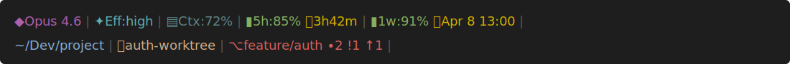

# Claude Code Plan Usage Statusline

A Ruby status line script for [Claude Code](https://docs.anthropic.com/en/docs/claude-code) that displays model, usage limits, git state, and workspace context in your terminal's status bar.

**Real rate limit data.** Most statusline tools estimate usage by counting tokens from local transcript files. This script calls Anthropic's OAuth API (`/api/oauth/usage`) and reads the server-side `five_hour` and `seven_day` utilization percentages directly -- the same numbers the rate limiter uses.

**No Keychain prompts.** Token is read via the macOS `security` CLI, not the Security framework APIs. macOS only prompts when an app calls those APIs directly; here the read is delegated to `/usr/bin/security` (a system-signed Apple binary), so no dialog ever appears.

## Screenshot



## Features

- **OAuth API usage** -- real 5-hour and weekly rate limit data from Anthropic's servers
- **Local caching** -- configurable TTL (default: 60s) to avoid repeated API calls
- **Git indicators** -- branch, worktree, staged/modified counts, ahead/behind
- **Color schemes** -- `minimal`, `colors`, and `background` display modes
- **Context window** -- remaining context percentage from Claude Code's input

## Requirements

- Ruby (system Ruby on macOS works fine)
- macOS with Claude Code authenticated (`claude` run at least once)

## Installation

```bash
curl -fsSL https://raw.githubusercontent.com/romacv/claude-plan-usage-statusline/main/install.sh | sh
```

Or manually: copy `statusline.rb` to `~/.claude/statusline.rb` and add to `~/.claude/settings.json`:

```json
{
  "statusLine": {
    "type": "command",
    "command": "CLAUDE_STATUS_DISPLAY_MODE=minimal ruby ~/.claude/statusline.rb",
    "padding": 0
  }
}
```

## Configuration

| Variable | Default | Description |
|---|---|---|
| `CLAUDE_STATUS_DISPLAY_MODE` | `colors` | `minimal`, `colors`, or `background` |
| `CLAUDE_STATUS_INFO_MODE` | `none` | `none`, `emoji`, or `text` |
| `CLAUDE_STATUS_CACHE_FILE` | `/tmp/claude_usage_cache.json` | Cache file path |
| `CLAUDE_STATUS_CACHE_TTL` | `60` | Cache lifetime in seconds |
| `CLAUDE_STATUS_KEYCHAIN_SERVICE` | `Claude Code-credentials` | Keychain service name |

## How It Works

1. Reads OAuth token from macOS Keychain via `security find-generic-password`
2. Calls `https://api.anthropic.com/api/oauth/usage` with the token
3. Caches the response locally; skips the API call if cache is fresh
4. Collects git state via `git status` / `git rev-parse` / `git rev-list`
5. Outputs a two-line status bar with model, context, usage, reset timer, and git info

## License

MIT
