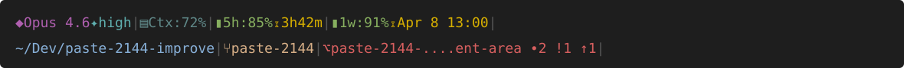

# Claude Code Plan Usage Statusline

Status line script for [Claude Code](https://docs.anthropic.com/en/docs/claude-code) that displays model, usage limits, git state, and workspace context in your terminal's status bar.

## Screenshot



**Real rate limit data.** Other tools count tokens locally from transcript files. This script reads server-side `five_hour` and `seven_day` utilization from Anthropic's OAuth API -- the actual numbers the rate limiter tracks.

**No permission prompts.** It's a plain CLI script, not a sandboxed app. Keychain is read by delegating to `/usr/bin/security` -- an Apple-signed system binary that already has Keychain access. The script itself never touches the Security APIs, so macOS has no reason to prompt. Outbound network from CLI doesn't trigger the firewall dialog either.

## Features

- **Model** -- current model name (long-context suffix compacted, e.g. `(1M context)` becomes `·1M`)
- **Effort** -- current effort level (when set via `/effort`)
- **Context window** -- remaining % from Claude Code's input, color-graded
- **5h usage** -- session headroom with countdown to reset, color-graded (amber at 35% left, red at 15% left); shows `?` when usage data is unavailable instead of a misleading 100%
- **1w usage** -- weekly headroom with reset date, color-graded
- **Loop status** -- shows an active recurring loop and its goal when a session loop-state file is present (see [Loop Status](#loop-status))
- **Cron display** -- shows upcoming scheduled crons from a registry file (see [Cron Display](#cron-display))
- **Git** -- branch, worktree (when in a git worktree), staged/modified counts, ahead/behind
- **Live refresh** -- cache updated automatically after each agent response via Claude Code `Stop` hook, with 30-second debounce

## Loop Status

The status bar shows whether a recurring loop is active for the current session and its goal:

- `⟳loop:15m goal:…` -- an active loop, interval and goal (goal truncated to fit)
- `⟳loop:off` -- no active loop

The segment reads a per-session state file at `~/.claude/loops/<session_id>.json`, keyed by the `session_id` Claude Code passes to the status line. Write it when a loop starts, remove it when the loop stops:

```json
{"active": true, "interval": "15m", "goal": "your goal here", "job_id": "abc123"}
```

Keying by session id means each session shows only its own loop, and a leftover file from a closed session is inert -- its id never recurs. When no matching file is present, the segment shows `⟳loop:off`.

## Cron Display

Claude Code session crons (scheduled via its `CronCreate` tool) are in-memory only -- the CLI has no API for a status line to query them. This status line instead reads a small JSON registry file that a running agent session is expected to keep in sync with its own scheduled crons, and renders a compact summary:

- `@21:01 sync-report` -- a one-shot cron, showing its next fire time and label
- `@*/30m poll-status` -- a recurring cron with no `next` time recorded, falling back to a short form of its `cron` field (`*/30 * * * *` -- every 30 minutes -- becomes `*/30m`)
- Multiple entries are separated by ` · `, capped at 3, with a trailing `+N` for any remainder beyond that

### Registry file

Path: `~/.claude/crons.json` -- a JSON array of cron entries:

```json
[
  {
    "id": "a1b2c3d4",
    "cron": "*/30 * * * *",
    "label": "poll-status",
    "next": "2026-08-03T21:30:00",
    "oneShot": false,
    "session": "session-id-here",
    "created": "2026-08-03T16:00:00"
  }
]
```

| Field | Required | Meaning |
| :--- | :--- | :--- |
| `id` | yes | Identifier for the cron (e.g. the id returned by `CronCreate`) |
| `cron` | yes | The cron expression, used as the display fallback when `next` is absent |
| `label` | yes | Short human-readable text shown next to the time; truncated with `…` beyond 22 characters |
| `next` | no | ISO-8601 **local** time of the next scheduled fire; when present, this is what's rendered instead of the raw `cron` field |
| `oneShot` | yes | `true` for a single scheduled run, `false` for a recurring cron |
| `session` | no | The session id that created the cron, for bookkeeping |
| `created` | yes | ISO-8601 local time the entry was registered |

### Who writes it

Claude Code itself does not write this file. The agent session that calls `CronCreate` or `CronDelete` is responsible for mirroring that call into the registry in the same turn: append an entry on create, remove it on delete. A one-shot entry is also expected to be removed once it fires (nothing re-reads a fired one-shot), since a scheduled cron only runs once and the agent session handling it is best placed to clean up its own entry. Multiple sessions may share the file; entries are additive and keyed by `id`, so one session's writes don't need to know about another's.

### Rendering rules

- Non-`Hash` entries in the array are ignored.
- A one-shot (`oneShot: true`) whose `next` has already passed is treated as stale and hidden -- it's expected to have been cleaned up already, but the status line hides it either way rather than showing a fired cron as upcoming.
- Remaining entries are sorted soonest-first by `next` (entries without a `next` sort last) and capped at 3, with any remainder shown as `+N`.
- Missing, empty, or corrupt files render nothing -- the segment fails silently and never crashes the status line.

## Standdown

When the companion [usage-guard](https://github.com/romacv/claude-usage-guard) has paused the session (headroom below its threshold, waiting for the limit to reset), the status bar adds a pause segment:

- `⏸paused by 5h limit, resume 20:01` -- the cause and the local clock time work will resume (date added when it's not today)

It sits next to the loop segment on the second line. The source (`by …`) is generic: usage-guard sets `5h limit`, but any scheduler that writes the marker's `by` field (a string or a list) shows there. The segment reads usage-guard's session-scoped marker at `~/.claude/usage-guard/standdown-<session_id>.json` and only appears while a breach is active -- if usage-guard isn't installed, the file is absent and nothing shows. It shares the usage cache this status line already maintains, so no extra API calls.

## Requirements

- Ruby (system Ruby on macOS works fine)
- macOS with Claude Code authenticated (`claude` run at least once)

## Installation

```bash
curl -fsSL https://raw.githubusercontent.com/romacv/claude-plan-usage-statusline/main/install.sh | sh
```

Or manually: copy `statusline.rb` to `~/.claude/statusline.rb` and add to `~/.claude/settings.json`:

```json
{
  "statusLine": {
    "type": "command",
    "command": "ruby ~/.claude/statusline.rb",
    "padding": 0
  }
}
```

## AI Agent Configuration Files

Settings and configurations for AI agents are stored in the following paths. Since these files are located inside hidden dotfile directories, you must always look deep inside them (and navigate via aliases/symlinks if needed) to manage and configure the agents:

| AI Agent | Settings File Path |
| :--- | :--- |
| **Claude Code** | `~/.claude/settings.json` |
| **Google Antigravity (`agy`)** | `~/.gemini/antigravity-cli/settings.json` |


## Uninstall

```bash
curl -fsSL https://raw.githubusercontent.com/romacv/claude-plan-usage-statusline/main/uninstall.sh | sh
```

Removes `statusline.rb`, `refresh-usage-cache.sh`, cache files, and the `statusLine` + `Stop` hook entries from `settings.json`.

## How It Works

1. Reads OAuth token from macOS Keychain via `security find-generic-password`
2. Calls `https://api.anthropic.com/api/oauth/usage` with the token
3. Caches the response locally; skips the API call if cache is fresh
4. Collects git state via `git status` / `git rev-parse` / `git rev-list`
5. Outputs a two-line status bar with model, context, usage, reset timer, git info, and loop status
6. A `Stop` hook runs `refresh-usage-cache.sh` asynchronously after each agent response, keeping the cache fresh without blocking Claude Code. Debounced to at most one API call per 30 seconds.

## Menu Bar

For a native menu bar experience, check out [Usage Battery for Claude Code](https://apps.apple.com/us/app/usage-battery-for-cluade-code/id6757597561?mt=12) on the Mac App Store.


## License

MIT
